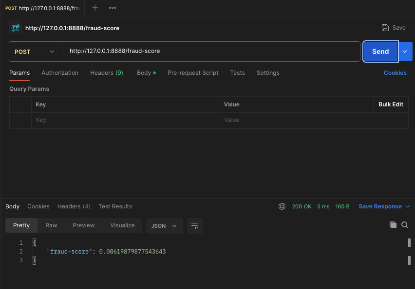

<p align="center">
  <h1 align="center">Sirius</h1>
  <p align="center"><strong>Realtime fraud scoring API</strong></p>
  <p align="center">
    
    
    
  </p>
</p>

---

Sirius wraps a pre-trained `RandomForestClassifier` behind a single HTTP endpoint and returns the **probability** a payment is fraudulent.

## Contents

- [Quick start](#quick-start)
- [API](#api)
- [The model](#the-model)
- [Performance](#performance)
- [Deployment](#deployment)
- [Monitoring](#monitoring)
- [Features in production](#features-in-production)
- [Testing](#testing)
- [Notes](#notes)
- [Given more time](#given-more-time)

## Quick start

### Docker

```bash
docker build -t sirius:local .
docker run --rm -p 8888:8888 sirius:local
```

### Local

Requires Python 3.10 and [Poetry](https://python-poetry.org/).

```bash
poetry install
poetry run uvicorn app.main:app --host 0.0.0.0 --port 8888
```

The service listens on `http://localhost:8888`, with OpenAPI docs at `/docs`. Verify with the supplied mock body:

```bash
curl -X POST http://localhost:8888/fraud-score \
  -H "Content-Type: application/json" \
  -d @tests/mock-request-body.json
```

Run the tests:

```bash
poetry run pytest
```

<details>
<summary>Why the versions are pinned</summary>

The brief requires `scikit-learn==1.0.2`, which pins the rest. `numpy<1.24` is needed because 1.24 removed the `np.float`/`np.int` aliases that 1.0.2 relies on, `pandas<2.3` follows from that, and Python is capped at `<3.11` because no 1.0.2 wheels exist for 3.11 and up. Relax any one of these and the model binary stops unpickling.
</details>

### Configuration

Read from the environment, with `.env` loaded at startup for local runs.

| Variable | Default | Purpose |
|---|---|---|
| `MODEL_PATH` | bundled `models/fraud-model.pickle` | Model artifact to serve. Resolved relative to the package root, so it works from any working directory. |
| `MODEL_VERSION` | `unknown` | Label returned as `model_version`. Set by the deploy pipeline to the artifact's version. |

## API

### `POST /fraud-score`

All 30 features required, all floats:

```json
{ "Time": 0.0, "V1": -1.3598, "V2": -0.0728, "...": "V3 through V28", "Amount": 149.62 }
```

Response:

```json
{
  "fraud-score": 0.086,
  "model_version": "v1.4.2-a3f9c1",
  "transaction_id": "a9b5080f-1ca3-4da8-a5bb-f11a9220897e"
}
```

`fraud-score` is `P(fraud)` in `[0, 1]`. The hyphenated key matches the brief and is carried by a Pydantic alias.

`model_version` comes from the `MODEL_VERSION` env var, defaulting to `unknown`. It costs nothing to include and without it a score cannot be attributed to the artifact that produced it, which makes A/B analysis and incident forensics guesswork.

`transaction_id` is the correlation id for the request, echoed in both the body and the `X-Transaction-Id` response header.

| Header | Direction | Meaning |
|---|---|---|
| `X-Transaction-Id` | request, optional | Correlation id. Supply one to trace a transaction across services; if absent a `uuid4` is generated. |
| `X-Transaction-Id` | response, always | The id in effect for this request, supplied or generated. Set on every response including `422` and `500`, which is when a caller most needs it. |

The same id is stamped on every JSON log line the request produces, so a score can be joined to its logs without logging the request body. Feature values stay out of the logs: they are personal data.

| Status | Meaning |
|---|---|
| `200` | Score returned |
| `422` | Body failed validation: missing, extra, or non-numeric fields |
| `500` | Inference failed; logged server-side, not echoed to the caller |

Validation happens at the boundary, and it is a deliberate design choice. The request schema is a Pydantic model, so three of the best practices the brief rewards fall out of one decision: malformed or missing fields are rejected with an automatic `422` before any model code runs, `extra="forbid"` enforces the exact contract instead of silently dropping unknown keys, and the typed `FraudResponse` makes the API self-documenting in `/docs`. Exception detail is deliberately kept out of `500` bodies so internals don't leak to callers.

### Operational endpoints

| Endpoint | Success | Purpose |
|---|---|---|
| `GET /health` | `200 {"status": "ok"}` | Liveness. Checks nothing but the process. |
| `GET /ready` | `200 {"status": "ready"}`, else `503 {"status": "not ready"}` | Readiness. Scores a throwaway zero row to prove the model works. |
| `GET /metrics` | `200`, Prometheus text | Request counts, latency histogram, in-flight gauge. |

**Liveness and readiness are deliberately different checks.** A liveness failure means "restart me", and a restart cannot reload a missing artifact or fix a corrupt one, so folding dependency checks into `/health` would turn a readiness problem into a restart loop. That split is why the container `HEALTHCHECK` probes `/health` while the ECS target group should point at `/ready`: the orchestrator restarts on the first, the load balancer drains on the second.

`/ready` runs a real `predict_proba` rather than testing the model global for truthiness, because "the object exists" and "the object can score" are different claims and only the second one means traffic should be routed here.

`/health`, `/ready` and `/metrics` are excluded from the metrics themselves. They fire on a fixed timer, so counting them would swamp real traffic and drag the latency percentiles toward the trivial handlers.

## The model

Fifteen trees, `max_depth=5`, trained on the ULB credit-card dataset (`Time`, `V1` to `V28`, `Amount`). Two facts about this binary shape the design.

**`V1` to `V28` are PCA components.** The publishers released only the components; the rotation matrix was never shared. So the service does no feature engineering. It expects already-transformed vectors. [How that stage would work in production is below.](#features-in-production)

**The estimator has no `feature_names_in_`.** It was fit on a raw array, so it silently accepts mis-ordered columns and returns a confident wrong answer. `FEATURE_COLUMNS` in `app/main.py` is the single source of truth for order, derived directly from the Pydantic schema (`list(Features.model_fields)`) so the two cannot drift. Nothing downstream would catch a mistake here, so the contract is pinned in one place and tested.

`Time` is a quirk. In the dataset it is seconds since the first record, meaningless to a real caller. It survives only because the model needs 30 columns, and it appears in just 1 of 321 split nodes. The real fix is retraining on 29 features, not asking clients for a number they can't produce.

## Performance

Target is p99 under 200ms, and the model is nowhere near the bottleneck. Fifteen depth-5 trees is about 75 comparisons, single-digit microseconds. The budget goes to JSON parsing, validation, and the HTTP round trip, so that is where tuning belongs.

- **`def`, not `async def`.** `predict_proba` is blocking CPU work; on the event loop it would stall every other request. As a sync endpoint FastAPI runs it in a threadpool, and sklearn releases the GIL in its Cython loop so those threads run in parallel. This is the change that actually protects the tail: a single request looks fast either way, but under concurrency an async blocking handler serialises everything behind the event loop and the p99 balloons.
- **Model loaded and warmed once on startup.** A FastAPI `lifespan` handler loads the pickle and runs one throwaway prediction before the server accepts traffic, so no request pays deserialization or sklearn's first-call costs, and a missing artifact fails the deploy fast rather than erroring mid-request.
- **The input row is a bare NumPy array**, built directly from `FEATURE_COLUMNS`, not a per-request `DataFrame`. That keeps roughly 100 to 200µs of DataFrame construction (an order of magnitude more than the prediction itself) off the hot path, and since the estimator was fitted without feature names, a bare array also avoids the per-call `X has feature names` warning sklearn would otherwise log on every request.

### Latency

Single-request latency is about 45ms locally (Postman, includes client and network overhead, so real server compute is lower):



A single request cannot show the tail. For p99 under load, `scripts/loadtest.sh` drives [`hey`](https://github.com/rakyll/hey) at 50 concurrent connections against the mock body. It warms the server with a throwaway burst first, so the measured run reflects steady state rather than a one-off cold-start batch, then prints:

| Metric | Value |
|---|---|
| Load | 20000 requests at concurrency 50 (after warm-up) |
| p50 | 38 ms |
| p90 | 64 ms |
| p95 | 79 ms |
| p99 | 188 ms |
| Throughput | 1082 req/s |

p99 lands just inside the 200ms target, and this is a deliberately pessimistic setup: a **single** uvicorn worker on a laptop absorbing all 50 concurrent connections itself. By Little's law, 1082 req/s at 50 in flight implies about 46ms average time in system, so the p99 is the queueing tail above a 38ms median on one saturated worker, not model time. Production runs one worker per core behind horizontal autoscaling (see the tuning notes), so no single task ever carries 50 concurrent alone; this number is the floor, and the real deployment has more headroom.

Reproduce (start the server without `--reload` so the measurement is production-like):

```bash
brew install hey                                              # once
poetry run uvicorn app.main:app --host 0.0.0.0 --port 8888    # terminal 1
./scripts/loadtest.sh                                         # terminal 2
```

The pytest suite includes a single-request smoke check, but a `TestClient` runs in-process and sequentially, so it cannot produce a meaningful p99. The tail number has to come from a real load tool against the running server, which is what the script above is for.

<details>
<summary>Tuning to apply and verify in the container</summary>

- `n_jobs=1` on the estimator. Joblib dispatch costs more than scoring 15 tiny trees.
- `OMP_NUM_THREADS=1` and `MKL_NUM_THREADS=1`. Otherwise each worker spawns a BLAS pool and oversubscribes the CPU, which shows up as erratic tail latency. (Set in the `Dockerfile`.)
- `workers = CPU cores`, scale horizontally. The workload is stateless and embarrassingly parallel, and the load test above shows why it matters: the tail is worker concurrency, not model time.
</details>

## Deployment

**Immutable image, model baked in.** A multi-stage `Dockerfile` on `python:3.10-slim`. The build stage resolves Poetry deps into a venv, the runtime stage copies just the venv and app and runs non-root. The model ships inside the image so the tag fully determines behaviour: rollback is a tag change, there is no network dependency at startup, and two replicas can't serve different versions. That is the right trade-off for a model retrained weekly or slower. If it were hourly I'd fetch from S3 at startup with a pinned, checksum-verified version and a readiness probe that fails closed.

**ECS Fargate behind an ALB.** Stateless, CPU-bound, horizontally scalable, so nothing here justifies managing nodes. EKS only if the platform were already Kubernetes. Point the target group health check at **`/ready`**, not `/health`: the ALB's job is to decide where to send traffic, so it wants the check that fails when the model can't score. The container `HEALTHCHECK` uses `/health`, which is the restart signal.

<details>
<summary>Services</summary>

| Concern | Service |
|---|---|
| Registry | ECR, scan-on-push |
| Compute | ECS Fargate |
| Ingress | ALB, TLS terminated at the load balancer |
| Autoscaling | target-tracking on requests per target |
| Config / secrets | SSM Parameter Store, Secrets Manager |
| Model artifacts | S3, with SageMaker Model Registry or MLflow for lineage |
| Logs / metrics | CloudWatch, Managed Prometheus and Grafana at volume |
| Tracing | X-Ray or OpenTelemetry to any OTLP backend |
| CI/CD | GitHub Actions to ECR to ECS, blue/green via CodeDeploy |
</details>

**Rollout: blue/green with auto-rollback** on a 5xx or p99 alarm. Minimum two tasks across AZs, because payment auth is in the critical path and a single task makes every deploy an outage.

**Validating a model change** uses two complementary steps, framed the way Checkout's own risk tooling does. Backtesting runs a candidate against specific historical periods and measures its performance offline in minutes, a fast first read on whether the change is worth shipping at all. Shadow testing then mirrors live traffic to the new version over time and logs its scores without acting on them, so its score distribution and would-be decisions can be compared against the incumbent on real traffic before promotion. Fraud models pass every offline metric and still shift approval rates in production, so the shadow run is the step that actually de-risks the rollout.

## Monitoring

Three layers, because a fraud service can be green on every infra metric while quietly making bad calls.

**Service health.** Request rate, error rate by status class, and duration as p50/p95/**p99** (never the mean, which hides the tail the SLO is written against), plus CPU and memory and ALB errors. Implemented: `prometheus-fastapi-instrumentator` exposes counts, a latency histogram and an in-flight gauge on `/metrics`, and logs are JSON on stdout with a `transaction_id` on every line, including uvicorn's own access logs. Structured output is what makes the correlation id useful, since CloudWatch Logs Insights can filter on it as a field rather than regex-matching a formatted string. **No PII or raw feature values** are logged.

**Model health**, the part that makes it an ML service, needed from day one:

- *Score-distribution drift* against a training baseline (PSI or KL). The leading indicator: it moves before any labels arrive and catches upstream pipeline breakage fastest.
- *Feature drift*, null rates, out-of-range counts. A feature silently arriving as zeros is a common, expensive failure.
- *Prediction volume* by segment, which catches traffic that stops as well as traffic that spikes.

**Business outcomes, on a lag.** True labels are chargebacks, weeks to months later. Precision, recall, and AUC at the threshold are a scheduled batch join against settled outcomes, backfilled to the prediction date, not a live dashboard. Track approval and false-positive rates too, since a model that fixes fraud by declining good customers is worse than the fraud.

## Features in production

The brief supplies precomputed features. In production they wouldn't be, and this is where most of the real work lives. Three layers: where the raw signals come from, how they are computed, and how they are served at scoring time.

**Sources.** The transaction itself (amount, currency, merchant, MCC, country); device and session signals collected client-side, for example a browser risk script like Checkout's Risk.js (device fingerprint, IP, session duration, cookies); and historical aggregates (velocity: transactions per card in the last hour, distinct devices per account).

**Computation.** Some features exist at request time (device, current amount); others are precomputed streaming aggregates (velocity counters maintained in a Kafka or Flink pipeline). The same transformation used in training, including the PCA, is then applied, so there is no train/serve skew.

<details>
<summary>Freshness tiers</summary>

| Class | Examples | Computed by | Latency |
|---|---|---|---|
| Realtime | txns on this card in 60s/5m/1h | Kafka/Kinesis to Flink | seconds |
| Near-realtime | 24h/7d velocity, device history | micro-batch Spark | minutes |
| Batch | cardholder tenure, merchant risk | nightly Spark/dbt | hours |
| Request-time | amount, currency, MCC, country | the request | none |
</details>

**Serving and access.** Features not carried in the request are read at scoring time from an online feature store built for low-latency point reads (Feast, Tecton, SageMaker Feature Store, or a Redis/DynamoDB layer), keyed by entity (card, device, account). The request carries the identifiers, the service does one batched key lookup (about 10 to 20ms), merges with request-time fields, and scores, comfortably inside 200ms. An offline store (S3/Parquet) holds full history for training and backfills. The important part is that **both tiers are populated by the same transformation code**, because reimplementing a feature separately for training and serving is the top source of train/serve skew.

**Fail soft, never block the payment.** If the online store times out or misses, fall back to training medians or a conservative default, flag the response as degraded, and alert on the degraded rate. Returning nothing forces the caller to decline or approve everything, both worse than a slightly weaker score.

**Point-in-time correctness in training.** Training sets are built with as-of joins that reconstruct each feature as it was at the transaction moment, never its current value, or you leak the future and inflate offline metrics.

For this model specifically, `V1` to `V28` come from an unpublished PCA rotation, so no pipeline could reproduce them. In a real system the fitted transformer would be bundled with the estimator in one versioned `sklearn.Pipeline`, so preprocessing can't drift from the model.

## Testing

`pytest` with FastAPI's `TestClient`, in-process, no sockets, runs in under a second. Four groups:

- **Contract**, the load-bearing one. Because the estimator has no feature names, mis-ordered input fails silently, so these assert `FEATURE_COLUMNS == list(Features.model_fields)`, that the count matches `model.n_features_in_`, that the row preserves declared order, and that `classes_ == [0, 1]` (else `predict_proba[:, 1]` is the *non*-fraud probability).
- **Scoring.** Status and range, agreement with a direct `predict_proba`, determinism, key-order independence, and a sensitivity sweep over the most-split features so a constant-output bug can't hide.
- **Validation.** Missing, non-numeric, null, and unknown fields all return `422`; ints coerce to floats; `GET` returns `405`.
- **Failure.** A patched estimator that raises must return `500` with the generic message and no exception text.
- **Observability.** `/health`, `/ready` (200 loaded, 503 when the model is patched out), the `X-Transaction-Id` contract (echoed when supplied, generated when not), `model_version` on the response, and `/metrics` exposed with the probe endpoints excluded.

Not yet covered: a golden-value test pinning the score for the mock body to catch an accidental model swap.

## Notes

- **Pickle is arbitrary code execution.** Fine here, since the artifact is trusted and baked into the image, but the path must never be caller-controllable, and a real pipeline would checksum against the registry. ONNX or skops removes the risk class entirely.
- **PII.** Transaction features are personal data under GDPR. No feature values or identifiers in logs; drift samples go to a separate, access-controlled store with a retention policy.
- **Not internet-facing.** Private subnet, internal ALB, exposed only to the auth service, callers authenticated by mTLS or a gateway token. TLS is terminated at the load balancer, so the service itself speaks plain HTTP on the private network.
- **Explainability.** With anonymised components, no reason code is human-meaningful. "Declined because V14 was low" helps no one. That is a modelling constraint the serving layer can't fix.

## Given more time

Roughly in the order I'd tackle them:

1. **Wire the load test into CI** and commit the resulting numbers, so the p99 table is enforced rather than a one-off.
2. **Distributed tracing.** The correlation id is in place, so the remaining step is OpenTelemetry spans exported to X-Ray or an OTLP backend, which is what makes the id useful across service boundaries rather than just within this one.
3. **Scrape the metrics somewhere.** `/metrics` is exposed but nothing collects it yet: Managed Prometheus plus Grafana dashboards, and the p99 and 5xx alarms that gate the blue/green rollback described above.
4. **Retrain without `Time`**, or wrap the estimator in a `Pipeline`, so the contract stops carrying a field that means nothing to callers.
5. **`docker-compose.yml`** once there are local dependencies (feature store, metrics collector) to bring up alongside the service.